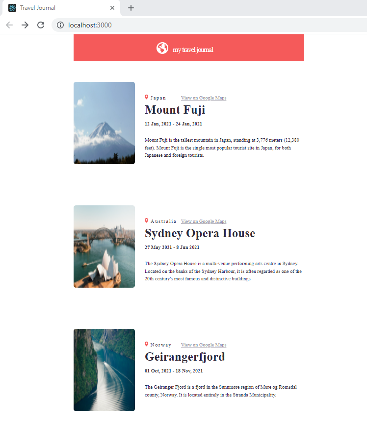

# React Travel Journal

This is a Solo Project idea/challenge from Scrimba.com. The challenge is to create a webpage that uses react props to display the components of a travel journal. The focus was to utilize data from a source and present the structure in a methodical way. The design can be found on Figma.com. This project was created locally using Create React App for bootstrapping (Scrimba encourages using their online environment).

* https://scrimba.com/learn/learnreact/
* https://www.figma.com/file/QG4cOExkdbIbhSfWJhs2gs/Travel-Journal?node-id=0%3A1
* This project was bootstrapped with [Create React App](https://github.com/facebook/create-react-app).

#

Screenshot of development build below:

 

#

1. Clone the repo
2. in the terminal type: npm start
